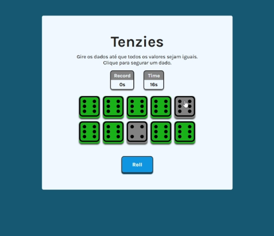

# 🎲 Tenzies Game

Um jogo de dados desenvolvido em React onde o objetivo é fazer todos os dados mostrarem o mesmo valor.

🌐 **Deploy:** https://tenzies-projeto.netlify.app/

---
## 🚀 Funcionalidades

- **Sistema de Timer**: Cronômetro que conta o tempo de cada partida
- **Sistema de Recorde**: Salva seu melhor tempo usando localStorage
- **Animação de Vitória**: Confete quando você completa o jogo

---
## 🛠️ Tecnologias Utilizadas

- React
- JavaScript (ES6+)
- CSS
- Vite
